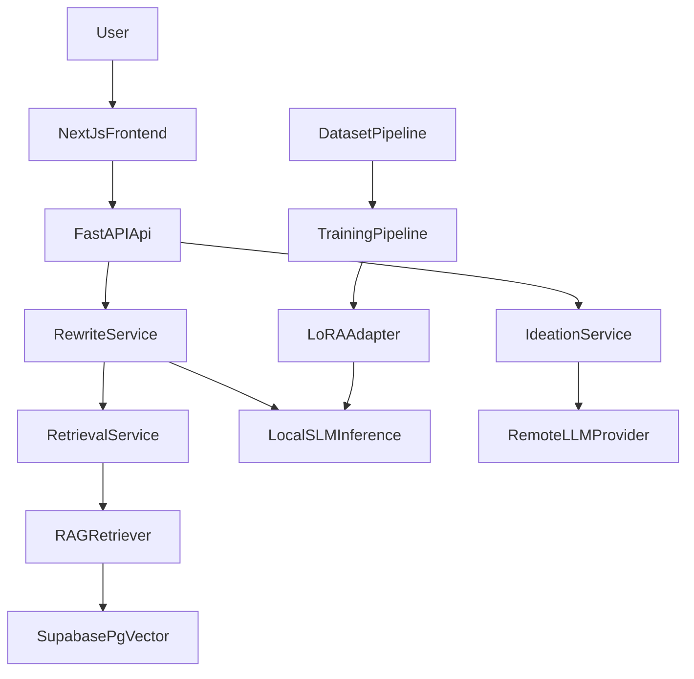

## Siru SLM Architecture

### Overview
`siru-slm` is a dual-model screenplay system:
- A remote large model generates or expands scene drafts.
- A local fine-tuned SLM rewrites dialogue in `mass`, `emotion`, or `subtext` modes.
- A RAG layer injects screenplay knowledge and style guidance.

### System Boundaries
- `frontend/`
  - Next.js presentation layer only.
  - Sends validated user intent to the backend.
  - Does not contain prompt construction or model-specific business logic.
- `api/routes/`
  - Thin HTTP controllers.
  - Accept requests, delegate to services, and return a consistent response envelope.
- `api/services/`
  - Orchestration and business logic.
  - Owns rewrite execution, ideation flow, retrieval coordination, health checks, logging, and dependency routing.
- `api/models/`
  - Request and response contracts.
  - Defines the shared `success/data/error` envelope for API clients.
- `inference/`
  - Local model-serving boundary.
  - Loads the base model plus LoRA and exposes an OpenAI-compatible endpoint for the API.
- `rag/`
  - Retrieval boundary.
  - Owns embedding generation, vector lookup, and local fallback knowledge retrieval.
- `dataset/`
  - Offline corpus generation and curation pipeline.
- `training/`
  - Fine-tuning and evaluation pipeline for the LoRA adapter.
- `ops/`
  - Logs, runbooks, and deployment-oriented operational guidance (including [Hugging Face Hub hosting](../ops/huggingface_hosting_guide.md)).

### Runtime Flow


### Codebase Architecture
The preferred layering is:
1. UI and transport in `frontend/`
2. HTTP boundary in `api/routes/`
3. Business services in `api/services/`
4. Shared schemas in `api/models/`
5. Local inference integration in `inference/`
6. Retrieval and embedding in `rag/`
7. Offline training and dataset preparation in `dataset/` and `training/`

### API Contract
All primary API endpoints should return:

```json
{
  "success": true,
  "data": {},
  "error": null
}
```

On failure:

```json
{
  "success": false,
  "data": null,
  "error": {
    "code": "validation_error",
    "message": "Request validation failed.",
    "details": {}
  }
}
```

This keeps the frontend stable even when transport and service errors differ.

### Model artifacts on Hugging Face Hub

Training produces a **LoRA adapter** (and optionally a **merged** full model). You may publish these to the Hub for versioning, collaboration, and managed inference; see [`ops/huggingface_hosting_guide.md`](../ops/huggingface_hosting_guide.md). The runtime diagram above still applies when inference pulls weights from Hub ids into your own GPU workers.

### Production Principles
- Keep the API stateless and horizontally scalable.
- Isolate GPU inference from the API because capacity and failure modes differ.
- Treat RAG as contextual guidance, not as unrestricted prompt stuffing.
- Keep provider-specific remote model logic inside `llm_client.py`.
- Use structured logging and dependency-aware health checks for operations.
