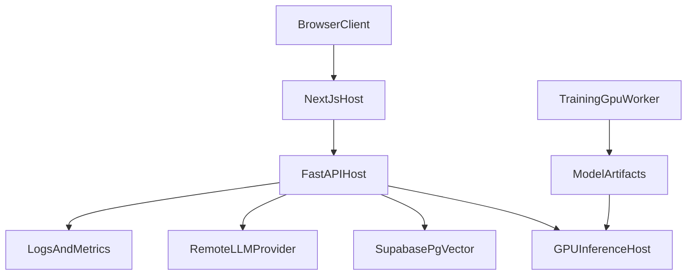

## Deployment Architecture

### Runtime Units
- `frontend`
  - Next.js application serving the user interface.
  - Calls the FastAPI backend through `NEXT_PUBLIC_API_BASE_URL`.
- `api`
  - Stateless FastAPI application.
  - Owns validation, orchestration, structured error handling, health checks, logging, and dependency routing.
- `inference`
  - GPU-backed vLLM runtime exposing an OpenAI-compatible endpoint.
  - Loads the base model and LoRA adapter used for rewrite requests.
- `supabase`
  - Managed vector store for retrieval data.
- `remote_llm`
  - External ideation provider reached through `llm_client.py`.

### Recommended Topology

### Environment Split
- Local development
  - Run `frontend`, `api`, and `inference` locally.
  - Use managed Supabase remotely.
- Production minimum
  - Deploy frontend and API independently.
  - Run inference on a GPU-capable host or worker node.
  - Use centralized logs and secret-managed environment variables.
- Scale-out path
  - Add multiple API replicas behind a load balancer.
  - Introduce an async work queue if GPU inference becomes a bottleneck.
  - Move embedding ingestion into a dedicated background worker.

### Required Configuration
- `ALLOWED_ORIGINS`
  - Comma-separated frontend origins allowed to call the API.
- `SLM_BASE_URL`
  - OpenAI-compatible base URL for the GPU inference service.
- `SLM_TIMEOUT_SECONDS`
  - Request timeout for rewrite calls.
- `SUPABASE_URL` and `SUPABASE_KEY`
  - RAG vector store connectivity.
- `OPENAI_API_KEY`
  - Embeddings provider for retrieval.
- `LLM_PROVIDER`, `LLM_API_KEY`, `LLM_API_BASE`, `LLM_MODEL`, `REPLICATE_API_TOKEN`
  - Remote ideation provider configuration.

### Operational Guardrails
- Restrict CORS to known frontend origins.
- Add authentication and rate limiting before public exposure.
- Use structured logs instead of `print`.
- Keep health checks dependency-aware so deployments fail fast when critical services are missing.
- Version the base model and LoRA adapter together and validate compatibility during rollout.
